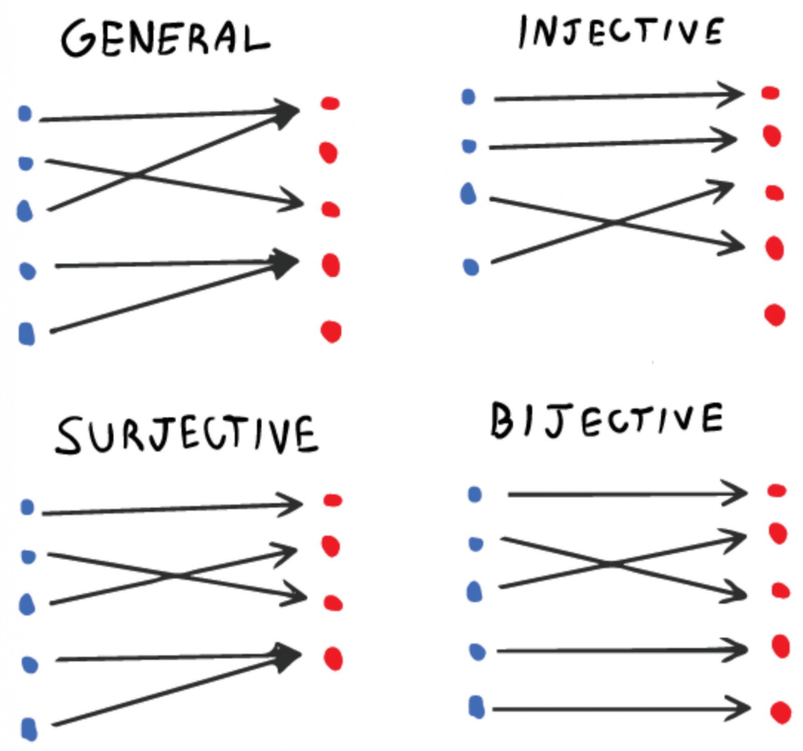
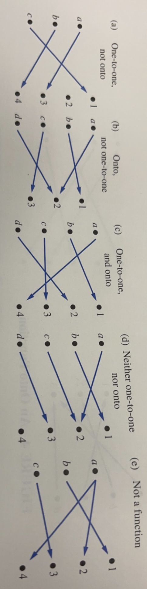
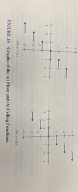
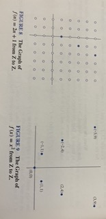

# Functions 

The concepts of functions are very important in mathematics and computer science.

In discrete, functions are defined by discrete structures of sequences and strings.

For example a function could represent how long it takes a computer to solve problems of a given size. 

### Definition : 

Let A and B be nonempty sets. A **function** f from A to B is an assignment of exactly one element of B to each element of A. We write $f(a) = b$ if $b$ is the unique element of B assigned by the function $f$ to the element $a$ of A.

In general, if $f$ is a function from $A$ to $B$, then we write : 

$$f : A → B$$

Note, functions are also called mappings or transformations.

A function like this can also be defined in terms of a relation from A to B. Recall, a relation from A to B is just a subset of A × B. A relation from A to B that contains only one oredered pair $(a, b)$ for every element $a ∈ A$, defines a funciton $f$ from A to B.

This function is defined by the assignment $f(a) = b$, where $(a, b)$ is the unique ordered pair in the relation that has $a$ as its first element.

### Definition : 

If $f$ is a function from $A$ to $B$, we say that $A$ is the **domain** of $f$ and $B$ is the **codomain** of $f$.  If $F(a) = b$, we say that $b$ is the **image** of $a$ and $a$ is a **preimage** of $b$. The **range**, or **image**, of $f$ is the set of all images of elements of $A$. 

If $f$ is a function from $A$ to $B$, we say that $f$ *maps* $A$ to $B$.

To functions are **equal** when they have the same domain and codomain, and map each element of their common domain to the same element in their common codomain. 

> When defining a function, we specify its domain, codomain, and the mapping of elements of the domain to elements in the codomain.

A function is **real-valued** if its codomain is the set of real numbers.

A function is **integer-valued** if its codomain is the set of integers.

### Definition :

Let $f_1$ and $f_2$ be functions from $A$ to **R**. Then $f_1 + f_2$ and $f_1f_2$ are also functions from $A$ to **R** defined for all $x ∈ A$ by :

$$(f_1 + f_2)(x) = f_1(x) + f_2(x)$$

and 

$$(f_1f_2)(x) = f_1(x)f_2(x)$$

When $f$ is a function from $A$ to $B$, the image of a subset of $A$ can also be defined.

### Definition : 

Let $f$ be afu nction from $A$ to $B$ and le4t $S$ be a subset of $A$. The **image** of $S$ under the function $f$ is the subset of $B$ that consists of the images of the elements of $S$. We denote the image of $S$ by : 

$$f(S) = \{t \text{ | } ∃s ∈ S ( t = f(s)) \}$$

This has shorthand notation : $\{f(s) \text{ | } s ∈ S\}$

Remark : 

The notation $f(S)$ for the image of the set $S$ under the function $f$ is potentially ambiguous. Here, $f(S)$ denotes a set, and not the value of the function $f$ for the set $S$.

---

## One-to-One and Onto Functions

**One-to-one** functions never assign the same value to two different domain elements.

### Definition : 

A function $f$ is **one-to-one**, or an **injunction** if and only if $f(a) = f(b)$ implies that $a = b$ for all $a$ and $b$ in the domain of $f$. 

> A function is injective if it is one-to-one

Note a function $f$ is one-to-one if and only if $f(a) ≠ f(b)$ whenever $a ≠ b$

This way of proving $f$ to be one-to-one is obtained by taking the contrapositive of the implication in the definition.

The way of expressing $f$ is one-to-one using quantifiers :

$$∀a∀b(f(a) = f(b) → a = b) ≡ ∀a∀b(a ≠ b → f(a) ≠ f(b))$$

### Definition :

A function $f$ whose domain and codomain are subsets of the set of real numbers is called *increasing* if $f(x) ≤ f(y)$, and *strictly increasing* if $f(x) < f(y)$ whenever $x < y$ and $x$ and $y$ are in the domain of $f$.

Similarly $f$ is called *decreasing* if $f(x) ≥ f(y)$ and *strictly decreasing* if $f(x) > f(y)$ whenever $x < y$ and $x$ and $y$ are in the domain of $f$.

**Using quantifiers :** 

$$\text{A function } f \text{ is... }$$

$$\text{ Increasing if } ∀x∀y(x < y → f(x) ≤ f(y))$$

$$\text{ Strictly increasing if } ∀x∀y(x < y → f(x) < f(y))$$

$$\text{ Decreasing if } ∀x∀y(x < y → f(x) ≥ f(y))$$

$$\text{ Strictly decreasing if } ∀x∀y(x < y → f(x) > f(y))$$

It can be shown that a function that is strictly increasing or strictly decreasing must be one-to-one.

For some functions, range and the codomain are equal.  That is, every member of the codomain is the image of some element of the domain. Functions with this property are called **onto functions**

### Definition : 

A function $f$ from $A$ to $B$ is called *onto* or a *surjection*, if and only if for every element $b ∈ B$ there is an element $a ∈ A$ with $f(a) = b$

Onto functions are refered to as surjective.

Using quantifiers, let $x$ be the domain of the function and $y$ be the codomain of the function. It follows : 

$$∀y∃x(f(x) = y)$$

### Definition : 

The funciotn $f$ is a  *one-to-one correspondence*, or a *bijection*, if it is both one-to-one and onto. We say the function is bijective.

---

To infer a function one-to-one or onto : 

$$\text{ Suppose that } f : A → B$$

- To show f is injective...

     - Show if $f(x) = f(y)$ for arbitrary $x, y ∈ A$ with $x ≠ y$, then $x = y$

- To show f is not injective...

     - Find particular elements $x, y ∈ A$ such that $x ≠ y$ and $f(x) = f(y)$

- To show f is surjective...

     - Consider an arbitrary element $y ∈ B$ and find an element $x ∈ A$ such that $f(x) = y$

- To show f is not surjective...

     - Find a particular $y ∈ B$ such that $f(x) ≠ y$ for all $x ∈ A$

---

## Inverse Functions and Compositions of Functions

Consider a one-to-one correspondence $f$ from the set $A$ to the set $B$. Since, f is onto, eveery element of $B$ is the image of some element in $A$. Furthermore, because $f$ is also a one-to-one function, every element of $B$ is the image of a *unique* element of $A$. 

Consequently, we can define a new function from $B$ to $A$ that reverses the corresondence given by $f$...

### Definition : 

Let $f$ be a one-to-one correspondence from the set $A$ to the set $B$. The *inverse function* of $f$ is the funciton that assigns to an element $b$ belongins to $B$ the unique element $a$ in $A$ such that $f(a) = b$. The inverse function of $f$ is denoted by $f^{-1}$ Hence : 

$$f^{-1}(b) = a \text{  when  } f(a) = b$$

**Remark :**

Be sure not to confuse the funciton $f^{-1}$ with the function $\frac{1}{f}$, which is the function that assigns to each x in the domain the value $\frac{1}{f}$.

This only makes sence when $f(x)$ is a non-zero real number.

> The inverse function of $f$

If a function $f$ is not a one-to-one correspondence, we cannot define an inverse function of $f$. When $f$ is not a one-to-one correspondence, eithere it is not one-to-one or it is not onto. 

If $f$ is not one-to-one, some element $b$ in the codomain is the image of more than one element in the domain. If $f$ is not onto, for some element $b$ in the codomain, no element $a$ in teh domain exists for which $f(a) = b$

Consequently, if $f$ is not a one-to-one correspondence, we cannot assign to each element $b$ in the codomain a unique element $a$ in the domain such that $f(a) = b$. Since for some $b$, there is either more than one such $a$ or no such $a$.

A one-to-one corresopndence is called **invertible** becasue we can define an inverse of this funciton. 

A function is **not invertible** if it is not a one-to-one correspondence, because the inverse of such a function does not exist.

### Definition : 

Let $g$ be a function from the set $A$ to the set $B$ and let $f$ be a funcitonf rom the set $B$ to the set $C$. The *composition* of the functions $f$ and $g$, denoted for all $a ∈ A$ by $f ∘ g$ , is defined by : 

$$(f ∘ g)(a) = f(g(a))$$

In other words, $f∘g$ is the function that assigns to the element $a$ of $A$ the element assigned by $f$ to $g(a)$. Tha is, to find $(f∘g)(a)$ we first apply the function $g$ to $a$ to obtain $g(a)$ and then we apply the function $f$ to the result $g(a)$ to obtain $f(g(a))$.

Note, the composition of f and g cannot be defined unless the range of g is a subset of the domain of $f$

> The Composition of the Functions f and g

---

## The Graphs of Funcitons

We can associate a set of pairs in $A × B$ to each function from $A$ to $B$. This set of pairs is called the **graph** of the function an is often displayed pictorially to aid in understanding the behavior of the function.

### Definition : 

Let $f$ be a function from the set $A$ to the set $B$. The *graph* of the function $f$ is the set of the ordered pairs 

$$\{(a, b) \text{ | } a ∈ A \text{ and } f(a) = b\}$$

By definition, the graph of a function $f$ from $A$ to $B$ is the subset of $A × B$ containing the ordered pairs with the second entry equal to the element of B assigned by $f$ to the first entry. 

Remember the graph of a function $f$ from $A$ to $B$ is the same as the relation from $A$ to $B$ determined by the function $f$

### Definition : 

The *floor function* assigns to the real numebr x the largest integer that is less than or equal to x. Denoted : $⌊x⌋$

The *ceiling function* assigns to the real number x the smallest integer that is greater than or equal to x. The value of the ceiling function at x is denoted by $⌈x⌉$ 

**Remark** 

The floor function is often also called the *greatest integer function*. Denoted $[x]$

---

Some useful properties about greatest integer functions : 

Let x be a real number and n an integer.

$$⌊x⌋ = n \text{ if and only if } n ≤ x < n + 1$$

$$⌊x⌋ = n \text{ if and only if }  x - 1 < n ≤ x$$

$$⌈x⌉ = n \text{ if and only if } n - 1 < x ≤ n$$

$$⌈x⌉ = n \text{ if and only if } x ≤ n < x + 1$$

$$x - 1 < ⌊x⌋ ≤ x ≤ ⌈x⌉ < x + 1$$

$$⌊-x⌋ = -⌈x⌉$$

$$ ⌈-x⌉ = -⌊x⌋$$

$$⌊x + n⌋ = ⌊x⌋ + n$$

$$⌈x + n⌉  = ⌊x⌋  + n$$

---

## Partial Functions 

### Definition : 

A *partial function* $f$ from a set $A$ to a set $B$ is an assignment to each element $a$ in a subset of $A$, called the *domain of definition* of $f$, of a unique element $b$ in $B$ 

The sets $A$ and $B$ are called the *domain* and *codomain* of $f$, respectively. 

We say $f$ is *undefined* for elements in $A$ that are not in the domain of defininition of $f$. When the domain of definition of $f$ equals $A$, we sayth at $f$ is a *total funciton*.

**Remark**

We write $f : A → B$ to denote that $f$ is a partial function from $A$ to $B$.

The context in which the notation is used determines whether $f$ is a partial or total funciton. 

