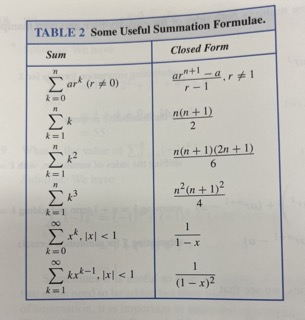

### Sequences and Summations 

Sequences are ordered lists of elements.

The terms for each sequence can be defined by formula.

### Definition : 

A *sequence* is a function from a subset of the setof  integers (usually either the set $\{0, 1, 2, ...\}$ or the set $\{1, 2, 3,...\}$) to a set $S$.

We use the notaion $a_n$ for terms of the sequence to denote the image of the integer n.

### Definition : 

A *geometric progression* is a sequence of the form : 

$$a, ar, ar^2, ..., ar^n, ...$$

where the initial term $a$ and the common ration r are real numbers. 

**Remark**

A geometric progression is a discrete analogue of the exponential function $f(x) = ar^x$

### Definition : 

An *arithmetic progression* is a sequence of the form : 

$$a, a + d, a + 2d, ... , a + nd, ...$$

where the *initial term* $a$ and the common difference $d$ are real numbers.

**Remark**

An arithmetic progression is a discrete analogue of the linear function $f(x) = dx + a$.

Finite sequences are also called **strings**.

---

## Recurrence Relations

### Definition : 

A *recurrence relation* for the sequence $\{a_n\}$ is an equation that expresses $a_n$ in terms of one orm ore of the previous terms of the sequence, namely, $a_0, a_1, ... , a_{n - 1}$ for all integers n with $n ≥ n_0$ where $n_0$ is a nonnegativei nteger. 

A sequence is called a *solution* of a recurrence realation if its terms satisfy the recurrence relation.

A recurrence relation is said to *recursively define* a sequence.

The **initial conditions** for a recursively defined sequence specify the terms that precede the first term wher ethe recurrence relation takes effect. 

Using mathematical induction, it can be shown that a recurrence relation together with its intiaial conditions determines a unique solution. 

**Fibonacci Sequence**

### Definition : 

The *Fibonacci sequence*, $f_0, f_1, f_2, ... $
 is defined by the initial conditions $f_0 = 0$ , $f_1 = 1$
with recurrence relation : 

$$f_n = f_{n - 1} + f_{n - 2}$$

for $n = 2, 3, 4, ....$

We say that we have solved the recurrence relation together with the intial conditions when we find an explicit formula, called a **closed formula**, for the terms of the sequence.

Methods of solving reccurrence relations include iteration, forward substitution, and backward substitution.

---

## Summations 

### Theorem 

If $a$ and $r$ are real numbers and $r ≠ 0$ then : 

$$∑_{j = 0}^{n}ar^j = \begin{cases}
\frac{ar^{n + 1}-a}{r - 1} \text{ if } r ≠ 1\\
(n + 1)a \text{ if } r = 1
\end{cases}$$

Proof : 

$$\text{ Let } S_n = ∑_{j = 0}^{n}ar^j$$

$$⟹ rS_n = r∑_{j = 0}^{n}ar^j$$

By distributive property : 

$$= ∑_{j = 0}^{n}ar^{j + 1} $$

By shifting the index : 

$$= ∑_{k = 1}^{n + 1}ar^{k} $$

Adding the $k = 0$ term and removing the $k = n + 1$ term : 

$$= (∑_{k = 0}^{n}ar^k) + (ar^{n + 1} - a)$$

Substituting $S_n$ : 

$$= S_n + (ar^{n + 1} - a)$$

$$∴ r S_n = S_n + (ar^{n + 1} - a)$$

Solving for $S_n$ shows if $r ≠ 1$ :

$$S_n = \frac{ar^{n + 1}-a}{r - 1}$$

If $r = 1$ then : 

$$S_n = ∑_{j = 0}^{n}ar^j = ∑ _{j = 0}^{n}a = (n + 1)a$$

## Some Infinite Series

Example : 

Let x be a real number with $|x| < 1$. 

$$\text{Find } ∑_{n = 0}^{∞}x^n = \lim_{k → ∞} \frac{x^{k + 1} - 1}{x - 1} = \frac{0 - 1}{x - 1} = \frac{1}{1 - x}$$

We can produce new summation formulae by differentiating or integrating existing formulae.

Differentiating both sides : 

$$\frac{d}{dx}∑_{k = 0}^{∞}x^k = \frac{d}{dx}\frac{1}{1 - x}$$

$$⟹ ∑_{k = 1}^{∞}kx^{k - 1} = \frac{1}{(1 - x)^2}$$

The differentiation is valid for $|x| < 1$ by a theorem about infinite series.

