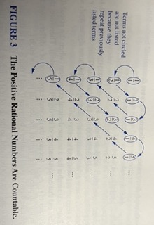

# Cardinality of Sets

Here we are measuring sizes of infinite sets comparably.

Countable infinite sets with same cardinality as positive integers

Rational numbers are countably infinite set.

Real number set is not countable.

Uncomputable functions exist.

### Definition : 

The sets $A$ and $B$ have the saame *cardinality* if and only if there is a one-to-one correspondence from $A$ to $B$ When A and B have the same cardinality, we write $|A| = |B|$

If there is a one-to-one correspondence function from $A$ to $B$, the cardinality of $A$ is less than or the same as the cardinality of $B$ and we write $|A| ≤ |B|$. 

## Countable Sets

### Definition 

A set that is either finite or has the same cardinality as the set of positive integers is called *countable*. When an infinite set $S$ is countable, we denote the cardinality of $S$ by $ℵ_0$ (ℵ aleph is the first letter in Hebrew alphabet)

We write $|S| = ℵ_0$ and say $S$ has cardinality "aleph null."

---

How to show a set is countable : 

Example : 

To show that the set of odd positive integers is countable, we exhibit a one-to-one correspondence between this set and the set of positive integers. Consider the function : 

$$f(n) = 2n - 1$$

from $\mathbb{Z}^+$ to the set of odd positive integers.

- We can show $f$ is a one-to-one correspondence by showing that it is both one-to-one and onto.

Proving one-to-one correspondence : 

Suppose : 

$$f(n) = f(m)$$

$$⟹ 2n - 1 = 2m - 1 ⟹ n = m$$

Proving onto correspondence : 

Suppose $t$ is an odd positive integer and $k$ is a natural number : 

$$⟹ t = 2k - 1 = f(k)$$

An infinite set is countable if and only if it is possible to list the elements of the set in a sequence indexed by the postive integers.

Example:  

Show the set of all integers is countable. 

- We can list all integers in a sequence by : 

$$0, 1, -1, 2, -2, 3, -3, ...$$

- Alternatively, we could find a one-to-one correspondence between the set of postive integers and the set of all integers. 

We have two cases : 

let n be any integer : 

$$f(n) = \frac{n}{2} \text{ when n is even }$$

$$f(n) = -\frac{(n - 1)}{2} \text{ when n is odd}$$

Therefore, the set of all integers is countable. 

Example : 

Show that the set of positive rational numbers is countable. : 

First, note every positive rational number is the quotient of $\frac{p}{q}$ where $p$ and $q$ are positive integers, by definition.

We can come up with this arrangement of the rational numbers : 

The set of positive rational numbers is countable.

---

## An Uncountable Set

**Cantor diagonalization argument** proves the set of real numbers is not countable.

- Georg Cantor (1879)

Show the set of real numbers is an uncountable set.

First, we prove by contradiction : 

Then using the definition of a set, any subset of any finite set will also be finite : 

Assume the set of real numbers is countable and the set of real numbers between $0$ and $1$ are countable, by definition. 

We have decimal representation of these real numbers :

$$r_1 = 0.d_{11}d_{12}d_{13}d_{14} \dots $$
$$r_2 = 0.d_{21}d_{22}d_{23}d_{24} \dots $$
$$r_3 = 0.d_{31}d_{32}d_{33}d_{34} \dots $$
$$r_4 = 0.d_{41}d_{42}d_{43}d_{44} \dots  $$
$$⋮ $$ 
where $d_{ij} ∈ \{0, 1, 2, 3, 4, 5, 6, 7, 8, 9\}$

This set has no way of listing all possible real numbers between $0$ and $1$ therefore we have our contradiction.

Therefore the set of real numbers is uncountable.

### Theorem 

If $A$ and $B$ are both countable sets, then $A ∪ B$ is also countable.

**Proof**

 Without loss of generality, we can assume that $A$ and $B$ are disjoint. 
 
 (If they're not, we can replace $B$ with $B - A$, because 
 $A ∩ (B - A) = ∅ $ 
 and $A ∪ (B - A) = A ∪ B$ )

Furthermore, without loss of generality, if one of the two sets is infinite and the other finite, we can assume that B is the one that is finite.

We have 3 cases : 

- First case 

When $A$ and $B$ are finite, $A ∪ B$ is also finite, and therefore countable. 

- Second case

$A$ is countably infinite and $B$ is finite. So we can list $A$'s elements as an infinite sequence and $B$'s terms as a finite sequence.

∴ $A ∪ B$ is countably infinite

- Third case 

Both $A$ and $B$ are countably infinite.

Since $A ∪ B$ is satisfied in all three cases, $A ∪ B$ is countable always.

### Theorem 

**Schröder-Bernstein Theorem** : If $A$ and $B$ are sets with $|A| ≤ |B|$ and $|B| ≤ |A|$, then $|A| = |B|$ This is one-to-one correspondence between $A$ and $B$ : with functions $f : A → B$ and $g : B → A$

---

### The continuum Hypothesis

Open question about cardinality.

It can be shown that the power set of $\mathbb{Z}^{+}$ and the set of real numbers $\mathbb{R}$ have the same cardinality.

We know $|P(\mathbb{Z}^{+})| = |\mathbb{R}| = c$ where $c$ denotes the cardinality of the set of real numbers

Cantor's theorem states that the cardinality of a set is always less than the cardinality of its power set : 

$$|\mathbb{Z}^{+}| < |P(\mathbb{Z}^{+})|$$

We can write this as 